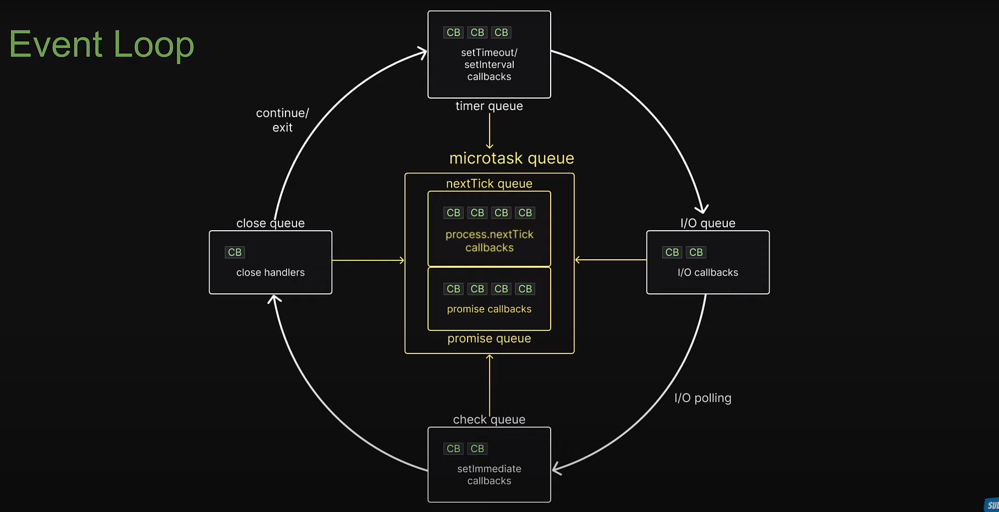
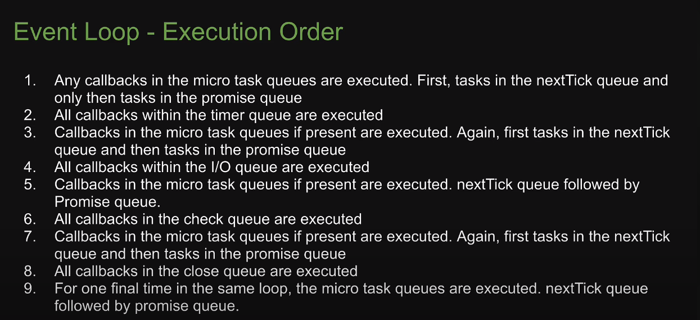
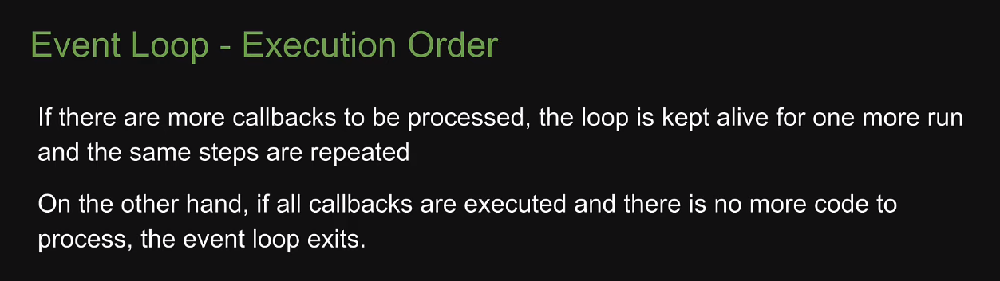
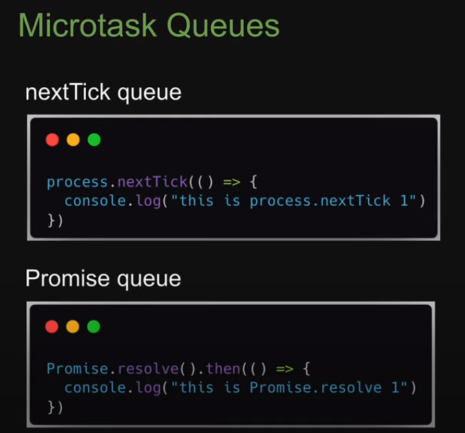

# Node.js Crash Course

These are the code examples from the [YouTube crash course](https://youtu.be/32M1al-Y6Ag). This is not a working app. It is a bunch of different examples. There are no 3rd party packages except Nodemon.

To run the simple server with the users API, run `npm start`

# Node.js Event Loop

Event loop playlist: https://youtube.com/playlist?list=PLC3y8-rFHvwj1_l8acs_lBi3a0HNb3bAN&si=J1VxrxPlTD9V4Eqp

Event loop tutorial: https://github.com/Tingkai911/nodejs-crash-2024

Boxes in yellow are not part of libuv.

Execution Order:
1) User written synchronous JS code takes priority over async code that the runtime would like to execute
2) Only after the call stack is empty, the event loop comes into picture

# Fetch API

https://blog.webdevsimplified.com/2022-01/js-fetch-api/

https://www.youtube.com/watch?v=cuEtnrL9-H0
